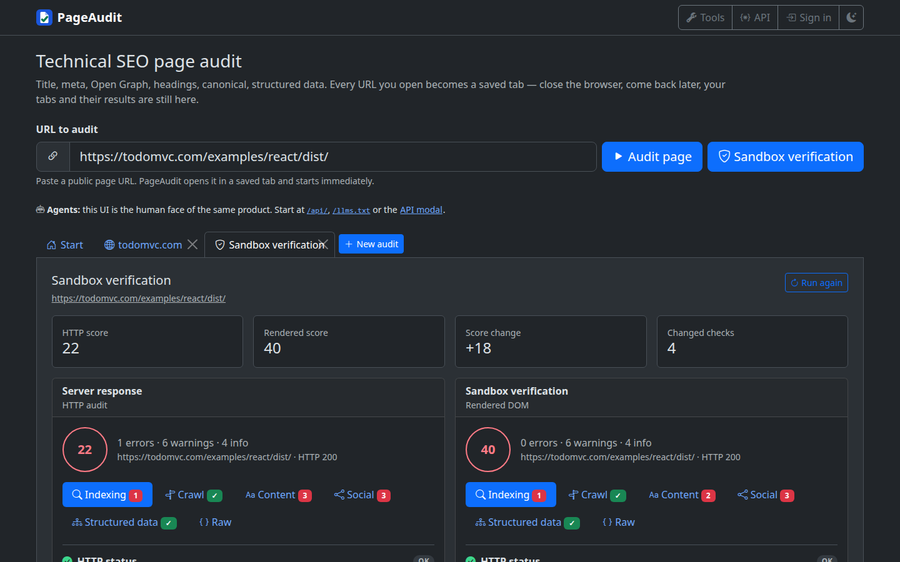
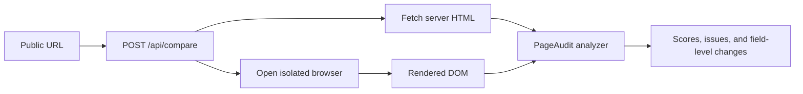

# PageAudit Rendered Audit

[Live demo](https://pageaudit-rendered.pages.dev) · [PageAudit](https://pageaudit.online)

PageAudit normally inspects the HTML returned by the server. This project adds a second pass in
an isolated browser, waits for the page to render, handles a standard consent prompt, and applies
the same PageAudit scoring rules to the resulting DOM.



## What the comparison means

| Pass | Input | What it reveals |
| --- | --- | --- |
| Server response | HTML returned by the target server | What a plain HTTP auditor, crawler, or client receives before page scripts run |
| Sandbox verification | DOM after browser rendering and hydration | Headings, metadata, canonical links, structured data, and other content created at runtime |

The two results are intentionally scored by the same analyzer. A difference therefore reflects a
change in the page after rendering, not a different scoring model.

## How it works



The Cloudflare Pages Worker keeps the browser credential server-side, proxies the regular
PageAudit API, and serves the same PageAudit workspace used by the live product. The browser
provider is isolated behind `src/sandbox-browser.js`; its name is not exposed in the product UI.

## Run locally

Requirements: Node.js 22+ and a browser-runtime credential for the live comparison.

```bash
git clone https://github.com/wrpbr/pageaudit-rendered-audit.git
cd pageaudit-rendered-audit
npm run validate
cp .dev.vars.example .dev.vars
# Set SANDBOX_API_KEY in .dev.vars without committing it.
npm run build
npm run dev
```

Open the local URL printed by Wrangler. The regular PageAudit UI remains usable without the
credential; `POST /api/compare` fails closed until the credential is configured.

## API

Health reports whether sandbox verification is available:

```bash
curl https://pageaudit-rendered.pages.dev/api/health
```

Compare one public page:

```bash
curl -X POST https://pageaudit-rendered.pages.dev/api/compare \
  -H 'content-type: application/json' \
  --data '{"url":"https://todomvc.com/examples/react/dist/"}'
```

The response contains `http`, `sandbox`, `changes`, and total `durationMs`. Each audit includes the
normal PageAudit score, categories, issues, and extracted summary.

## Safety boundaries

- Only public HTTP(S) targets are accepted; loopback, link-local, RFC1918, and private literal IPs
  are rejected again on every HTTP redirect.
- HTTP bodies are capped at 2 MiB and browser DOM analysis at 800,000 characters.
- Fetches and browser commands have explicit timeouts; browser sessions are released in `finally`.
- The browser credential is read only by the Worker and never sent to client-side JavaScript.
- The textual URL guard does not resolve DNS, so production egress policy remains part of the
  defense against DNS rebinding.

## Project layout

```text
src/public/               PageAudit workspace assets
src/rendered-preview.js   comparison tab and presentation
src/worker.js             API, proxy, limits, and security headers
src/sandbox-browser.js    isolated-browser adapter
src/pageaudit/            shared analyzer and comparison logic
scripts/                  deterministic build and build-contract checks
test/                     worker, browser-adapter, UI, and analyzer tests
```

## Deployment

The demo is deployed to Cloudflare Pages by CI. Production pins an exact source commit and stores
`SANDBOX_API_KEY` as a Pages secret. `version.json` records the source and deployment commits used by
the live build.

## License

MIT. The isolated-browser adapter retains attribution to the MIT-licensed upstream implementation
from Pinetree Research; see [LICENSE](LICENSE).
